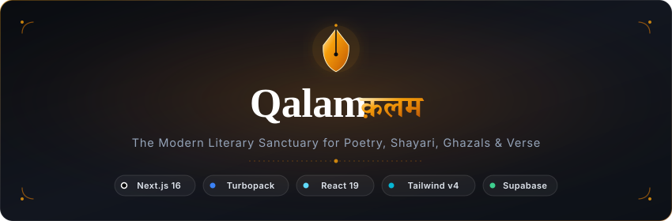
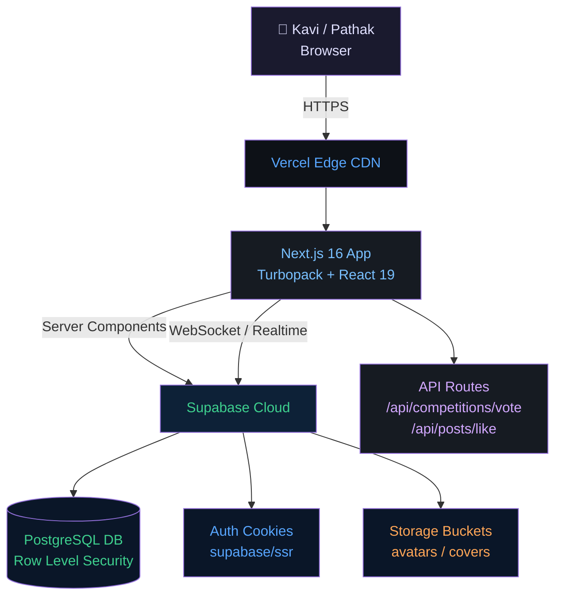
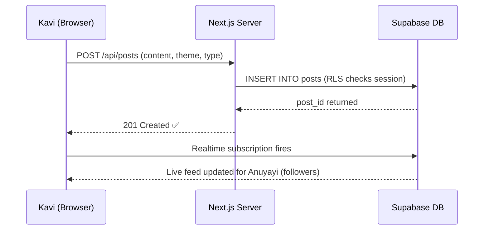
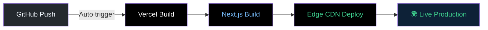

# Qalam · क़लम — Modern Literary Sanctuary

<div align="center">



<br/><br/>

[](https://nextjs.org/)
[](https://turbo.build/)
[](https://react.dev/)
[](https://tailwindcss.com/)
[](https://www.typescriptlang.org/)
[](https://supabase.com/)
[](LICENSE)

<br/>

**Every poet deserves a stage that presents their Rachna exactly as it was written.**
*Qalam is the digital Manch where Kavita, Shayari, Ghazal, and Chhanda find their true home.*

<br/>

[Overview](#-overview) • [Design System](#-design-system--typographic-craft) • [Themes](#-the-5-reading-themes) • [Features](#-features) • [Architecture](#-system-architecture) • [Getting Started](#-getting-started) • [Security](#-security)

</div>

---

## 🌟 Overview

Most social media platforms break poetry line by line — they collapse indents, strip spacing, and kill the rhythm that a Kavi spent hours perfecting.

**Qalam** (क़लम — *Kalam*, meaning *Pen*) was built to solve exactly that.

It is a specialized literary platform that treats **Shabd (words)** with the dignity they deserve. Every Doha, Ghazal, Haiku, or Mukt Chhanda lives here in its original structure — exactly as it was written. Kavi and Pathak (reader) both get a beautiful, focused, and literary experience.

```
  "The mark of a great platform is not that it changes the Rachna —
   it is that it makes it shine."
```

---

## 🎨 Design System & Typographic Craft

Qalam is designed with an uncompromising focus on **editorial elegance**, **typographic precision**, and **delightful micro-interactions**.

```
┌──────────────────────────────────────────────────────────┐
│              QALAM TYPOGRAPHIC ENGINE                    │
└──────────────────────────┬───────────────────────────────┘
                           │
       ┌───────────────────┼───────────────────┐
       ▼                   ▼                   ▼
 Editorial Serif     Devanagari Soul       Modern UI Sans
  Lora / Georgia    Yatra One / Rozha    Inter / System
 Verse body & titles  Brand & Hindi Kavita  Navigation & UI
```

### Typography & Meter Preservation

- **Line Preservation:** Every Kavya-Pankti (poetic line) is displayed exactly as the Kavi wrote it — no collapse, no trimming, no loss of cadence.
- **Multilingual Font Stack:**
  - **Lora & Georgia** → Classical editorial warmth for verse bodies and titles.
  - **Yatra One & Rozha One** → Expressive Devanagari for Hindi Rachna — evoking handcrafted Indian printmaking.
  - **Inter** → Clean, balanced sans-serif for navigation and UI tokens.
- **RTL Script Support:** Automatic bidirectional directionality (`dir="rtl"`) with calibrated line-heights for scripts that require it.

### Micro-Interactions & Motion Design

- **❤️ Like Animation:** Tapping the heart bursts golden-red particles outward — appreciating a Rachna feels like an event.
- **✅ Read Receipts:** Messages transition to a turquoise double-tick the moment they are read.
- **⬇️ Scroll Anchor:** Scrolling back through conversation history reveals a floating button counting unread messages — tap to return to the present.
- **🪟 Glassmorphic Portals:** All modals (Likes, Voters, Lightbox, Crop, Theme Picker) render into `document.body` via React Portals — backdrop blur and spring transitions throughout.

---

## 🎭 The 5 Reading Themes

Every Rachna carries its own Bhav (emotion). Writers on Qalam can dress their Kavita in one of **5 bespoke themes**, adjusting typography, colors, textures, and borders across feeds, profiles, and reading views:

| Theme | Mood & Palette | Character |
|---|---|---|
| **📜 Classic Parchment** | Warm Sepia `#fbf8f1` & Terracotta | Vintage manuscripts, aged paper, nostalgic ink — a library you never want to leave. |
| **🌌 Midnight Ink** | Deep Charcoal `#0f131a` & Amber | Minimal night-reading elegance — high contrast, subtle amber borders, pure focus. |
| **🔮 Amethyst Mystique** | Twilight Velvet `#140d1e` & Violet | Dreamy and mystical — made for romantic, melancholic, and contemplative Kavita. |
| **🌿 Emerald Grove** | Forest Spruce `#0a1612` & Sage | Earth-toned botanical calm — for Prakriti Kavita, mindfulness, and philosophy. |
| **🌅 Sunset Ember** | Warm Ochre `#1c120c` & Crimson Gold | Radiant terracotta tones — passion, celebration, and spiritual Bhav in one palette. |

---

## ✨ Features

### 🖋️ Rachna Studio — Distraction-Free Writing

- **Poetic Formats:** Dedicated support for **Kavita, Shayari, Ghazal, Haiku, Mukt Chhanda (Free Verse)**, and **Uddharan (Quotes)**.
- **Live Preview:** Test-drive themes, cover images, and tags in real time before publishing your Rachna.
- **Draft or Publish:** Keep Rachna private as a work-in-progress, or share it with the whole Manch.

### 📰 Dual-Feed Discovery

- **Latest & Trending 🔥:** Seamlessly toggle between freshest Rachna and most celebrated Kavita.
- **Multilingual Filtering:** Filter by language — Hindi, English, Punjabi, Bengali, Marathi, and more — or by literary genre.
- **OpenGraph Previews:** Automatic rich preview cards generated for WhatsApp, Twitter/X, and LinkedIn shares.

### 💬 Sahityik Mandal & Direct Messaging

- **Real-Time Messaging:** Low-latency WebSockets powered by Supabase PostgreSQL Realtime.
- **Group Mandal (Circles):** Create writing Mandals, assign admins, update group photos, and mention members with `@username`.
- **Rich Media:** Inline sticker drawer, photo/video sharing with preview modal, full-screen lightbox.
- **Chat Themes:** Personalize each conversation thread with a custom background theme.

### 🏆 Rachna Pratiyogitaen (Competitions)

- **Live Countdown:** Transparent deadline timers — *"Submissions closing in 2 days"*, *"Voting closes tomorrow"*.
- **Democratic Voting (Matdan):** Community members vote for their favourite Rachna — live counters, instant feedback.
- **Voters Modal:** See exactly who voted — avatars, usernames, and profile links.
- **Podium Rankings:** 🥇 🥈 🥉 — real-time ribbon badges sorted dynamically by vote count.

### 👤 Kavi Profiles & Social Graph

- **Rachna Sangrah:** Every Kavi gets a dedicated hub — published works, Anuyayi (follower) count, and custom bio.
- **Photo Crop Tool:** Client-side avatar and cover photo cropper with aspect-ratio locking.
- **Relationship Modals:** Browse followers and following lists with one-click follow/unfollow buttons.

---

## 🛠️ System Architecture



### Data Flow — Publishing a Rachna



### Technology Matrix

| Layer | Technology | Role |
|---|---|---|
| **Framework** | [Next.js 16.3](https://nextjs.org/) | App Router, Server Components, Turbopack |
| **UI Runtime** | [React 19.2](https://react.dev/) | Server Components, Suspense boundaries |
| **Language** | [TypeScript 5](https://www.typescriptlang.org/) | End-to-end type safety |
| **Styling** | [Tailwind CSS v4](https://tailwindcss.com/) | CSS variable design tokens & utilities |
| **UI Primitives** | [Radix UI](https://www.radix-ui.com/) | Accessible dialogs, tabs, dropdowns |
| **Icons** | [Lucide React](https://lucide.dev/) | Scalable, consistent vector icons |
| **Database** | [PostgreSQL (Supabase)](https://supabase.com/) | Relational models, triggers, Realtime |
| **Auth** | [Supabase Auth](https://supabase.com/auth) | HTTP-only cookie sessions via `@supabase/ssr` |
| **Hosting** | [Vercel](https://vercel.com/) | Edge runtime, global CDN, zero-config CI/CD |

---

## 📁 Project Structure

```
Qalam/
├── app/                        # Next.js App Router
│   ├── (auth)/                 # Login / Signup pages
│   ├── competitions/           # Pratiyogita pages
│   │   └── [id]/               # Individual competition view
│   ├── feed/                   # Main Rachna feed
│   ├── messages/               # Real-time Mandal & DM
│   ├── profile/[username]/     # Kavi profile hub
│   └── api/                    # Server-side API routes
│       ├── competitions/vote/  # Matdan (voting) endpoint
│       └── posts/like/         # Like endpoint
│
├── components/
│   ├── posts/                  # PostCard, PostEditor
│   ├── competitions/           # VoteButton, VotersModal
│   ├── chat/                   # MessageBubble, ChatInput
│   └── ui/                     # Reusable design system
│
├── lib/
│   ├── supabase/               # DB client & type definitions
│   └── utils.ts                # formatDate, formatDeadline
│
├── supabase/
│   ├── schema.sql              # Full DB schema with RLS
│   └── migrations/             # Incremental schema migrations
│
└── public/
    └── qalam-banner.svg        # Brand identity banner
```

---

## 🔒 Security

This repository is structured for **safe public open-source distribution**:

1. **🔑 Zero Hardcoded Secrets:** All credentials, database keys, and API URLs are resolved from runtime environment variables only.
2. **🛡️ Row Level Security (RLS):** Every PostgreSQL table has explicit RLS policies — anonymous public keys cannot bypass access rules.
3. **🍪 Cookie Isolation:** Auth tokens live in encrypted HTTP-only cookies via `@supabase/ssr` — protected from client-side XSS.
4. **📁 Git Hygiene:** `.env*.local` files and build artifacts are `.gitignore`d — no secret has ever been committed.

---

## 🚀 Getting Started

### Prerequisites

- **Node.js:** v20.x or later
- **npm:** v10.x or later
- **Supabase Account:** Free tier at [supabase.com](https://supabase.com)

### 1. Clone the Repository

```bash
git clone https://github.com/Aniket4477/Qalam.git
cd Qalam
```

### 2. Install Dependencies

```bash
npm install
```

### 3. Database Setup

1. Create a new project in your [Supabase Dashboard](https://database.new).
2. Open the **SQL Editor**.
3. Execute the full contents of `supabase/schema.sql` — this creates all tables, triggers, and RLS policies.
4. Run any additional migrations from `supabase/migrations/`.
5. In **Storage**, create two public buckets: `avatars` and `covers`.

### 4. Environment Configuration

```bash
cp .env.local.example .env.local
```

Fill in your credentials from **Supabase Dashboard → Project Settings → API**:

```env
# Supabase
NEXT_PUBLIC_SUPABASE_URL=https://your-project-id.supabase.co
NEXT_PUBLIC_SUPABASE_ANON_KEY=your-anon-public-key
SUPABASE_SERVICE_ROLE_KEY=your-service-role-secret-key

# Application
NEXT_PUBLIC_SITE_URL=http://localhost:3000
```

### 5. Start the Development Server

```bash
npm run dev
```

Visit **[http://localhost:3000](http://localhost:3000)** and start writing.

---

## 🌐 Deploying to Vercel



1. Push your code to GitHub.
2. In [Vercel](https://vercel.com/), click **Add New → Project** and import your repository.
3. Add your environment variables in Vercel settings:
   - `NEXT_PUBLIC_SUPABASE_URL`
   - `NEXT_PUBLIC_SUPABASE_ANON_KEY`
   - `SUPABASE_SERVICE_ROLE_KEY`
   - `NEXT_PUBLIC_SITE_URL` (e.g. `https://your-app.vercel.app`)
4. In **Supabase Dashboard → Authentication → URL Configuration**:
   - Set **Site URL** to your production domain.
   - Add `https://your-app.vercel.app/**` to **Redirect URLs**.
5. Hit Deploy — Vercel handles everything else.

---

## 🤝 Contributing

Contributions are always welcome! Here is the flow:

```bash
# 1. Fork and clone
git clone https://github.com/your-username/Qalam.git

# 2. Create a feature branch
git checkout -b feature/your-feature-name

# 3. Commit your changes
git commit -m "feat: describe your Rachna here"

# 4. Push
git push origin feature/your-feature-name

# 5. Open a Pull Request
```

---

## 📜 License

Distributed under the **MIT License**. See [LICENSE](LICENSE) for details.

<br/>

<div align="center">

```
    "Words have power — they just need the right Manch."
```

**Crafted with ❤️ for every Kavi, shayar, and dreamer.**

*Lafzon ko dijiye ek maqam — Qalam क़लम*

</div>
