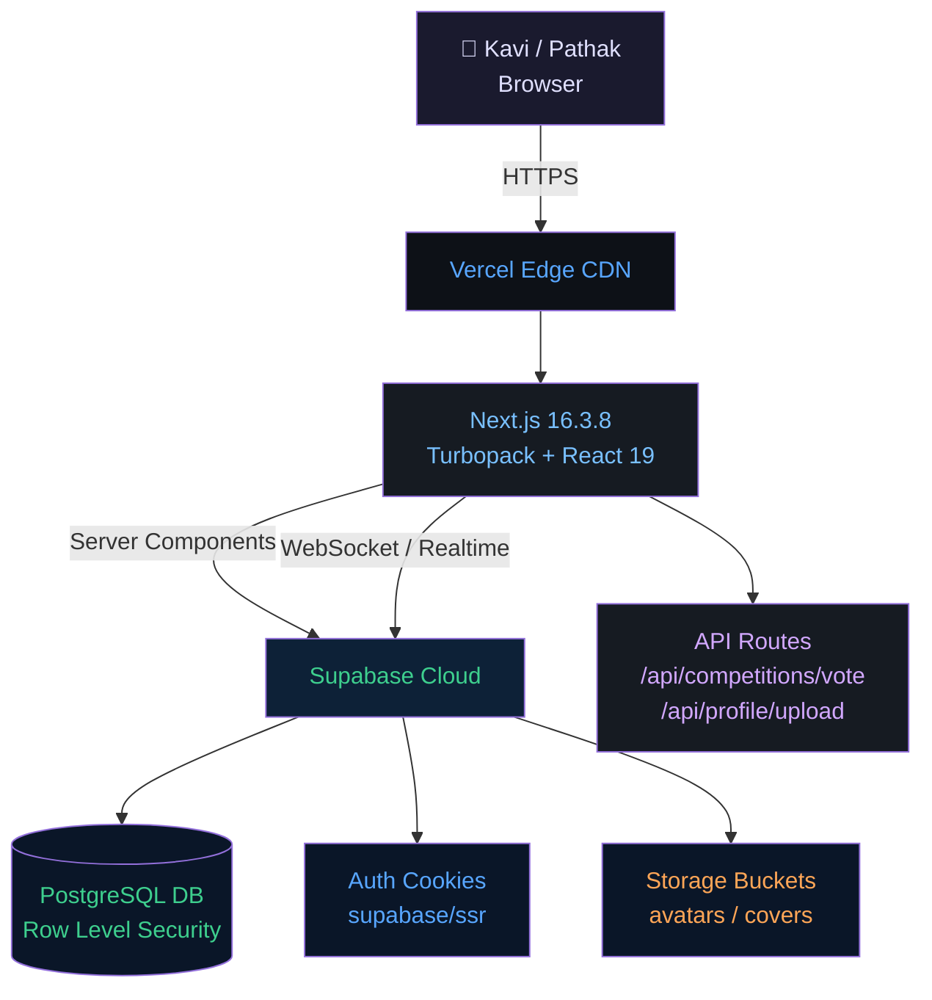
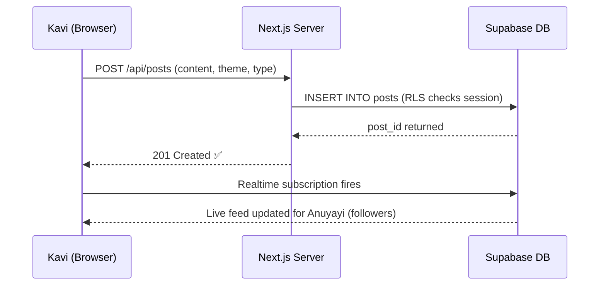
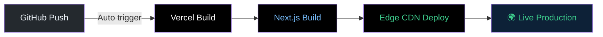

# Qalam · क़लम — Modern Literary Sanctuary

<div align="center">


<br/><br/>

[](https://nextjs.org/)
[](https://turbo.build/)
[](https://react.dev/)
[](https://tailwindcss.com/)
[](https://www.typescriptlang.org/)
[](https://supabase.com/)
[](LICENSE)
[](#-security)

<br/>

**Every poet deserves a stage that presents their Rachna exactly as it was written.**
*Qalam is the digital Manch where Kavita, Shayari, Ghazal, and Chhanda find their true home.*

<br/>

[Overview](#-overview) • [Features](#-features) • [Design](#-design-system--typographic-craft) • [Themes](#-the-5-reading-themes) • [Components](#-components) • [Architecture](#-system-architecture) • [Security](#-security) • [Getting Started](#-getting-started)

</div>

---

## 🌟 Overview

Most social media platforms break poetry line by line — they collapse indents, strip spacing, and kill the rhythm that a Kavi spent hours perfecting.

**Qalam** (क़लम — *Kalam*, meaning *Pen*) was built to solve exactly that.

It is a specialized literary platform that treats **Shabd (words)** with the dignity they deserve. Every Doha, Ghazal, Haiku, or Mukt Chhanda lives here in its original structure — exactly as it was written. Kavi and Pathak (reader) both get a beautiful, focused, and literary experience.

```
  "The mark of a great platform is not that it changes the Rachna —
   it is that it makes it shine."
```

---

## ✨ Features

### 🖋️ Rachna Studio — Distraction-Free Writing
- **Poetic Formats:** Kavita, Shayari, Ghazal, Haiku, Mukt Chhanda (Free Verse), and Uddharan (Quotes)
- **Live Preview:** Test-drive themes, cover images, and tags in real time before publishing
- **Draft or Publish:** Keep Rachna private or share it with the whole Manch

### 📰 Dual-Feed Discovery
- **Latest & Trending 🔥:** Toggle between freshest Rachna and most celebrated Kavita
- **Multilingual Filtering:** Hindi, English, Punjabi, Bengali, Marathi, and more
- **OpenGraph Previews:** Rich cards for WhatsApp, Twitter/X, and LinkedIn

### 💬 Sahityik Mandal & Direct Messaging
- **Real-Time Messaging:** Low-latency WebSockets via Supabase PostgreSQL Realtime
- **Group Mandal (Circles):** Create writing Mandals, assign admins, mention members with `@username`
- **Rich Media:** Stickers, photo/video sharing with preview modal and full-screen lightbox
- **Chat Themes:** 5 themed backgrounds per conversation — Ocean, Sunset, Love, Nature, Classic
- **Glassmorphic Input Bar:** Transparent, frosted-glass message bar that lets the chat theme shine through

### 🏆 Rachna Pratiyogitaen (Competitions)
- **Live Countdown:** Transparent deadline timers — *"Submissions closing in 2 days"*
- **Democratic Voting (Matdan):** Community votes for favourite Rachna — live counters
- **Voters Modal:** See exactly who voted — avatars, usernames, profile links
- **Podium Rankings:** 🥇 🥈 🥉 real-time ribbon badges by vote count

### 👤 Kavi Profiles & Social Graph
- **Rachna Sangrah:** Published works, Anuyayi (follower) count, custom bio
- **Photo Crop Tool:** Client-side avatar and cover photo cropper
- **Relationship Modals:** Followers and following lists via React Portals — centered on all screen sizes

### 🔔 Notifications
- Real-time notification feed for likes, follows, comments, and competition activity

---

## 🎨 Design System & Typographic Craft

```
┌──────────────────────────────────────────────────────────┐
│              QALAM TYPOGRAPHIC ENGINE                    │
└──────────────────────────┬───────────────────────────────┘
                           │
       ┌───────────────────┼───────────────────┐
       ▼                   ▼                   ▼
 Editorial Serif     Devanagari Soul       Modern UI Sans
  Lora / Georgia    Yatra One / Rozha    Inter / System
 Verse body & titles  Brand & Hindi Kavita  Navigation & UI
```

### Typography & Meter Preservation
- **Line Preservation:** Every Kavya-Pankti is displayed exactly as the Kavi wrote it
- **Lora & Georgia** → Classical editorial warmth for verse bodies and titles
- **Yatra One & Rozha One** → Expressive Devanagari for Hindi Rachna
- **Inter** → Clean, balanced sans-serif for navigation and UI

### Micro-Interactions & Motion Design
- **❤️ Like Animation:** Heart tap bursts golden-red particles — appreciating a Rachna feels like an event
- **✅ Read Receipts:** Messages transition to turquoise double-tick when read
- **⬇️ Scroll Anchor:** Floating button counting unread messages in chat
- **🪟 Glassmorphic Portals:** All modals rendered to `document.body` via React Portals

---

## 🎭 The 5 Reading Themes

| Theme | Mood & Palette | Character |
|---|---|---|
| **📜 Classic Parchment** | Warm Sepia `#fbf8f1` & Terracotta | Vintage manuscripts, aged paper, nostalgic ink |
| **🌌 Midnight Ink** | Deep Charcoal `#0f131a` & Amber | Night-reading elegance — high contrast, subtle amber |
| **🔮 Amethyst Mystique** | Twilight Velvet `#140d1e` & Violet | Dreamy and mystical — romantic, melancholic Kavita |
| **🌿 Emerald Grove** | Forest Spruce `#0a1612` & Sage | Earth-toned calm — Prakriti Kavita and philosophy |
| **🌅 Sunset Ember** | Warm Ochre `#1c120c` & Crimson Gold | Passion, celebration, and spiritual Bhav |

---

## 🧩 Components

### Auth
| Component | Description |
|---|---|
| `AuthForm.tsx` | Email/password & Google OAuth login/signup with strength indicator |

### Posts
| Component | Description |
|---|---|
| `PostCard.tsx` | Feed card for any post type with theme rendering |
| `PostEditor.tsx` | Full-featured Rachna creation studio |
| `PostActions.tsx` | Like, comment, share action bar |
| `PostDetailEngagement.tsx` | Full engagement section on post detail page |
| `LikeButton.tsx` | Animated like button with particle burst |
| `LikedByText.tsx` | Social proof text showing who liked |
| `PostLikesModal.tsx` | Modal listing all Likers via React Portal |
| `CommentList.tsx` | Threaded comment section |
| `ShareButton.tsx` | Share post to chat (Send Post) |
| `SendPostButton.tsx` | Trigger button for sending post to Mandal |
| `SendPostModal.tsx` | Modal to select conversation to share post in |

### Competitions
| Component | Description |
|---|---|
| `CompetitionEnterButton.tsx` | Enter a competition with one click |
| `CompetitionVoteButton.tsx` | Vote/unvote with optimistic UI & live counter |
| `CompetitionVotedByText.tsx` | Social proof — "Voted by X people" |
| `CompetitionVotersModal.tsx` | Full voters list modal with follow status |
| `AdminCompetitionControls.tsx` | Admin-only competition management panel |

### Messages & Chat
| Component | Description |
|---|---|
| `MessageThread.tsx` | Full DM (direct message) thread with real-time updates |
| `GroupMessageThread.tsx` | Group Mandal chat thread |
| `ChatInputBar.tsx` | Glassmorphic pill-shaped message composer with emoji, stickers, media |
| `EmojiPickerPopover.tsx` | Emoji selection popover |
| `ChatStickersDrawer.tsx` | Literary badge sticker drawer |
| `ChatThemeModal.tsx` | Chat background theme picker |
| `MediaUploadPreviewModal.tsx` | Preview & caption before sending media |
| `MediaLightboxModal.tsx` | Full-screen media viewer |
| `MessageBodyWithMentions.tsx` | Message body renderer with @mention highlighting |
| `MessageStatusTicks.tsx` | Delivered/Read tick indicators |
| `MessagesClient.tsx` | Messages sidebar/conversation list |
| `CreateGroupModal.tsx` | Create a new group Mandal |
| `GroupInfoModal.tsx` | Group settings, member management |
| `NewMessageSearch.tsx` | User search to start a new conversation |

### Profile
| Component | Description |
|---|---|
| `ProfileFollowStats.tsx` | Follower/Following count buttons |
| `FollowsModal.tsx` | Followers/Following list modal via React Portal — centers correctly on all devices |
| `FollowButton.tsx` | Follow/Unfollow toggle button |
| `ImageCropModal.tsx` | Avatar/cover image cropping tool |
| `UserCard.tsx` | Compact user profile card |
| `BackButton.tsx` | Context-aware back navigation |

### Feed & Navigation
| Component | Description |
|---|---|
| `HomeFeedTabs.tsx` | Latest / Trending feed tab switcher |
| `Navbar.tsx` | Global navigation bar with theme toggle |

### Notifications
| Component | Description |
|---|---|
| `MarkNotificationsRead.tsx` | Auto-marks notifications as read on mount |

### Providers & UI
| Component | Description |
|---|---|
| `ThemeProvider.tsx` | Dark/light theme context via `next-themes` |
| `toaster.tsx` | Toast notification system |

---

## 🛠️ System Architecture



### Data Flow — Publishing a Rachna



### Technology Matrix

| Layer | Technology | Role |
|---|---|---|
| **Framework** | [Next.js 16.3.8](https://nextjs.org/) | App Router, Server Components, Turbopack |
| **UI Runtime** | [React 19.2](https://react.dev/) | Server Components, Suspense, Portals |
| **Language** | [TypeScript 5](https://www.typescriptlang.org/) | End-to-end type safety |
| **Styling** | [Tailwind CSS v4](https://tailwindcss.com/) | CSS variable design tokens |
| **UI Primitives** | [Radix UI](https://www.radix-ui.com/) | Accessible dialogs, tabs, dropdowns |
| **Icons** | [Lucide React](https://lucide.dev/) | Scalable vector icons |
| **Database** | [PostgreSQL (Supabase)](https://supabase.com/) | Relational models, triggers, Realtime |
| **Auth** | [Supabase Auth](https://supabase.com/auth) | HTTP-only cookie sessions via `@supabase/ssr` |
| **File Validation** | [file-type](https://github.com/sindresorhus/file-type) | Magic-byte MIME validation for uploads |
| **Hosting** | [Vercel](https://vercel.com/) | Edge runtime, global CDN, zero-config CI/CD |

---

## 📁 Project Structure

```
Qalam/
├── app/                          # Next.js App Router
│   ├── (auth)/
│   │   ├── login/                # Sign in page
│   │   └── signup/               # Create account page
│   ├── auth/callback/            # OAuth callback handler
│   ├── competitions/             # Pratiyogita listing & detail
│   │   ├── [id]/                 # Individual competition view
│   │   └── new/                  # Create competition (admin)
│   ├── explore/                  # Browse & search Rachna
│   ├── feed/ (app/page.tsx)      # Main Rachna feed (Latest + Trending)
│   ├── messages/                 # Real-time Mandal & DM
│   │   ├── [conversationId]/     # Direct message thread
│   │   ├── group/[groupId]/      # Group Mandal thread
│   │   └── new/                  # Start new conversation
│   ├── notifications/            # Activity feed
│   ├── post/[id]/                # Full post detail
│   ├── settings/                 # Account settings
│   ├── u/[username]/             # Kavi profile hub
│   ├── write/                    # Rachna creation studio
│   └── api/
│       ├── competitions/vote/    # Matdan (voting) API
│       └── profile/upload/       # Secure file upload API
│
├── components/                   # UI components (see Components section)
│
├── lib/
│   ├── supabase/                 # DB client & type definitions
│   ├── fileValidation.ts         # Magic-byte file type validation
│   ├── passwordValidation.ts     # Password strength rules
│   ├── rateLimit.ts              # Server-side rate limiting
│   ├── getClientIdentifier.ts    # IP/fingerprint for rate limits
│   ├── chatStickers.ts           # Literary sticker definitions
│   ├── chatThemes.ts             # Chat background themes
│   └── utils.ts                  # Shared utilities
│
├── supabase/
│   ├── schema.sql                # Full DB schema with RLS
│   └── migrations/               # Incremental schema migrations
│
└── public/
    └── qalam-banner.svg          # Brand identity banner
```

---

## 🔒 Security

This project has undergone a **comprehensive security hardening pass**. All changes are in production.

### Security Headers (via `next.config.ts`)
| Header | Value |
|---|---|
| `Strict-Transport-Security` | `max-age=31536000; includeSubDomains` |
| `X-Frame-Options` | `SAMEORIGIN` |
| `X-Content-Type-Options` | `nosniff` |
| `X-XSS-Protection` | `1; mode=block` |
| `Referrer-Policy` | `strict-origin-when-cross-origin` |
| `Permissions-Policy` | `camera=(), microphone=(), geolocation=()` |

### Authentication & Sessions
- Auth tokens stored in **encrypted HTTP-only cookies** via `@supabase/ssr` — never in `localStorage`
- CSRF protection handled by Supabase's SameSite cookie configuration
- Password strength enforced: 10+ characters, uppercase, lowercase, number, special character
- Real-time password strength indicator on signup

### File Uploads (`/api/profile/upload`)
- **Magic-byte validation** via `file-type` — rejects files that lie about their extension
- **Strict MIME allowlist:** only `image/jpeg`, `image/png`, `image/gif`, `image/webp`
- **5 MB size limit** enforced server-side
- **Path traversal prevention:** uploads only allowed to `{userId}/` or `groups/` paths
- **Bucket allowlist:** only `avatars` and `covers` buckets accepted

### Rate Limiting
| Endpoint | Limit |
|---|---|
| `/api/profile/upload` | 10 requests / minute |
| `/api/competitions/vote` | 30 requests / minute |
| General API | 100 requests / minute |

Returns `429 Too Many Requests` with `Retry-After` header when exceeded.

### Database Row Level Security (RLS)
- RLS enabled on **all tables** in PostgreSQL
- Users can only read/write their own data
- Vote table enforces `auth.uid() = user_id` on INSERT and DELETE
- Service-role key is **never exposed** to the client

### Dependency Security
- `next` upgraded to **16.3.8** — patches 5 CVEs including a Critical RCE in `next/og`
- `file-type` added for magic-byte validation
- `npm audit` → **0 vulnerabilities**

### Open Redirect Prevention
- `auth/callback` validates the `next` parameter — only relative paths allowed

---

## 🚀 Getting Started

### Prerequisites
- **Node.js:** v20.x or later
- **npm:** v10.x or later
- **Supabase Account:** [supabase.com](https://supabase.com) — free tier

### 1. Clone the Repository
```bash
git clone https://github.com/Aniket4477/Qalam.git
cd Qalam
```

### 2. Install Dependencies
```bash
npm install
```

### 3. Database Setup
1. Create a new project in [Supabase Dashboard](https://database.new)
2. Open **SQL Editor** and execute `supabase/schema.sql`
3. Run migrations from `supabase/migrations/`
4. In **Storage**, create two public buckets: `avatars` and `covers`

### 4. Environment Configuration
```bash
cp .env.local.example .env.local
```

Fill in from **Supabase Dashboard → Project Settings → API**:

```env
# Supabase
NEXT_PUBLIC_SUPABASE_URL=https://your-project-id.supabase.co
NEXT_PUBLIC_SUPABASE_ANON_KEY=your-anon-public-key
SUPABASE_SERVICE_ROLE_KEY=your-service-role-secret-key

# Application
NEXT_PUBLIC_SITE_URL=http://localhost:3000
```

> ⚠️ **Never commit `.env.local`** — it is gitignored by default.

### 5. Start Development Server
```bash
npm run dev
```

Visit **[http://localhost:3000](http://localhost:3000)** and start writing.

---

## 🌐 Deploying to Vercel



1. Push your code to GitHub
2. In [Vercel](https://vercel.com/) → **Add New → Project** → import repository
3. Add environment variables:
   - `NEXT_PUBLIC_SUPABASE_URL`
   - `NEXT_PUBLIC_SUPABASE_ANON_KEY`
   - `SUPABASE_SERVICE_ROLE_KEY`
   - `NEXT_PUBLIC_SITE_URL` (e.g. `https://your-app.vercel.app`)
4. In **Supabase → Auth → URL Configuration**: set Site URL and add redirect URL
5. Deploy — Vercel handles the rest

---

## 🤝 Contributing

```bash
# 1. Fork and clone
git clone https://github.com/your-username/Qalam.git

# 2. Create a feature branch
git checkout -b feature/your-feature-name

# 3. Commit your changes
git commit -m "feat: describe your Rachna here"

# 4. Push and open a Pull Request
git push origin feature/your-feature-name
```

---

## 📜 License

Distributed under the **MIT License**. See [LICENSE](LICENSE) for details.

<br/>

<div align="center">

```
    "Words have power — they just need the right Manch."
```

**Crafted with ❤️ for every Kavi, shayar, and dreamer.**

*Lafzon ko dijiye ek maqam — Qalam क़लम*

</div>
